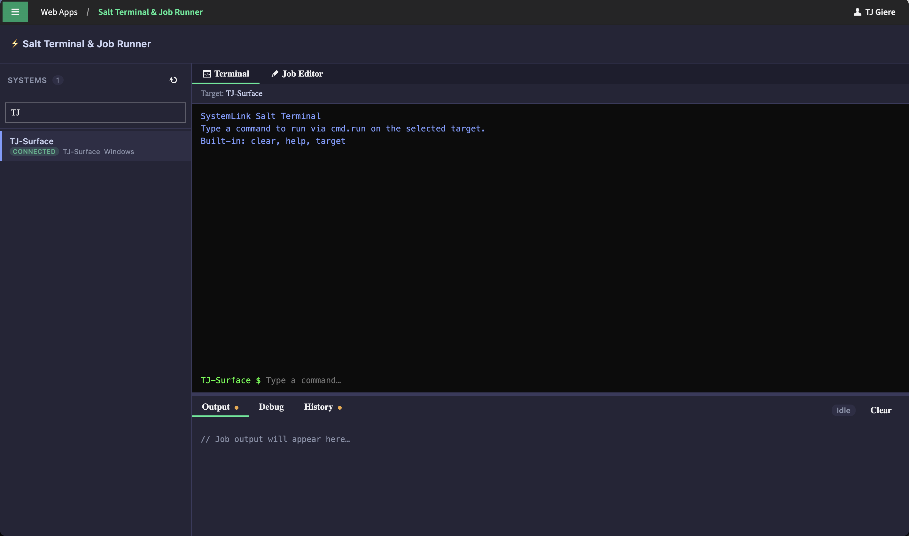

# Salt Terminal & Job Runner

> **AI-Generated Code Notice:** This project was developed with the assistance of AI coding tools (GitHub Copilot). The code has been reviewed by a human developer but may contain AI-generated patterns, logic, or suggestions. Users should review and test thoroughly before use in production environments.

A SystemLink webapp for executing and managing Salt jobs on connected systems. Built with **Angular 19** and the **[Nimble Design System](https://nimble.ni.dev)**.



## Features

- **Terminal Mode** (default) — CLI-style interface that runs commands via `cmd.run` on the selected target
- **Job Editor** — CodeMirror 6 JSON editor for crafting Salt job payloads
- **Preset Jobs** — Quick-access common Salt functions:
  - `cmd.run` — Run a shell command
  - `grains.items` — System grain data
  - `test.ping` — Connectivity check
  - `pkg.list_pkgs` — Installed packages
  - `service.get_all` — List services
  - `disk.usage` — Disk usage
  - `status.all_status` — System status (Linux only)
  - `nisysmgmt.set_network_address` — Configure network settings
  - `cmd.fetch_minion_log` — Retrieve Salt minion log (Windows & Linux)
- **Saved Jobs** — Save, load, and delete job definitions (stored as `.saltjob` files via the SystemLink File Ingestion API)
- **Job History** — View past jobs for the selected system with Edit/Terminal action buttons
- **Output & Debug Tabs** — View job results and internal debug logs
- **System Search** — Filter connected systems by name or hostname

## Security Notice

Users must have the `Systems Management \ Execute remote commands` privilege to run commands on systems via the `[POST] /nisysmgmt/v1/jobs` route. Ensure that only highly trusted users have a role that grants this privilege.

## Architecture

Angular 19 standalone components with Nimble Design System UI components.

| Path                      | Purpose                                                     |
| ------------------------- | ----------------------------------------------------------- |
| `src/app/`                | Angular components and services                             |
| `src/app/services/`       | SystemsService, JobsService, SavedJobsService, DebugService |
| `src/app/system-panel/`   | System list sidebar component                               |
| `src/app/terminal/`       | Terminal mode component                                     |
| `src/app/output-panel/`   | Tabbed output panel (Output/Debug/History)                  |
| `src/app/save-dialog/`    | Save job dialog component                                   |
| `src/app/data/presets.ts` | Preset job definitions                                      |

### Tech Stack

- **Angular 19** — Standalone components, no NgModule
- **@ni/nimble-angular** — NI Nimble design system components (buttons, tabs, select, dialog, text-field, toolbar, spinner)
- **CodeMirror 6** — JSON editor with one-dark theme
- **TypeScript** — Strict typing throughout

### APIs Used

| API                | Endpoint                                                  | Purpose                |
| ------------------ | --------------------------------------------------------- | ---------------------- |
| Systems Management | `POST /nisysmgmt/v1/query-systems`                        | List connected systems |
| Systems Management | `POST /nisysmgmt/v1/jobs`                                 | Submit Salt jobs       |
| Systems Management | `GET /nisysmgmt/v1/jobs?jid=`                             | Poll job status        |
| Systems Management | `POST /nisysmgmt/v1/query-jobs`                           | Job history            |
| File Ingestion     | `POST /nifile/v1/service-groups/Default/upload-files`     | Save job definitions   |
| File Ingestion     | `POST /nifile/v1/service-groups/Default/query-files-linq` | List saved jobs        |
| File Ingestion     | `GET /nifile/v1/service-groups/Default/files/{id}/data`   | Load saved job content |
| File Ingestion     | `DELETE /nifile/v1/service-groups/Default/files/{id}`     | Delete saved jobs      |

## Development

```bash
# Install dependencies
npm install

# Development server
npx ng serve

# Production build
npx ng build
```

## Deployment

Requires [slcli](https://github.com/ni/systemlink-cli) configured with a SystemLink server profile.

```bash
# Build, pack, and publish
npx ng build
slcli webapp pack dist/salt-terminal/browser --output /tmp/salt-terminal-job-runner.nipkg
slcli webapp publish /tmp/salt-terminal-job-runner.nipkg -n "Salt Terminal & Job Runner" -w Default

# Update (delete old, publish new)
slcli webapp delete -i <WEBAPP_ID> --yes
slcli webapp publish /tmp/salt-terminal-job-runner.nipkg -n "Salt Terminal & Job Runner" -w Default
```

## CSP Notes

The webapp uses Nimble design system components and CodeMirror 6, both bundled via npm. No external CDN dependencies or inline scripts.

## License

This project is licensed under the MIT License — see the repository [LICENSE](../../../LICENSE) for details.
