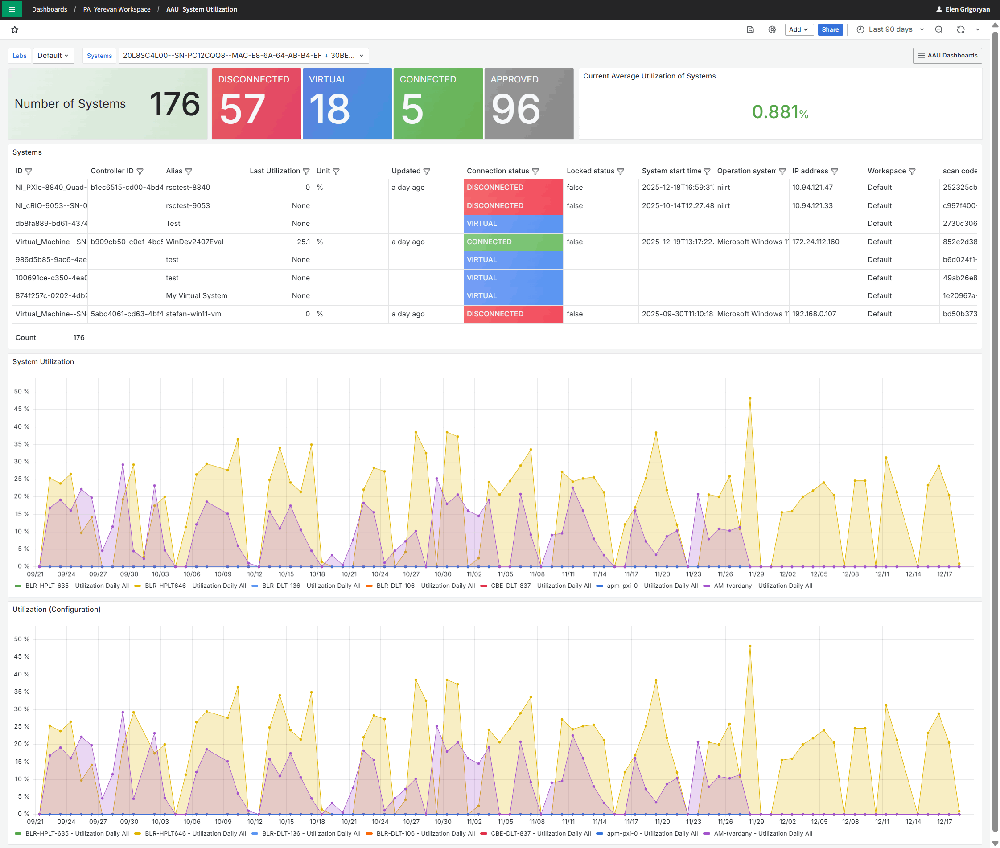
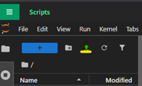
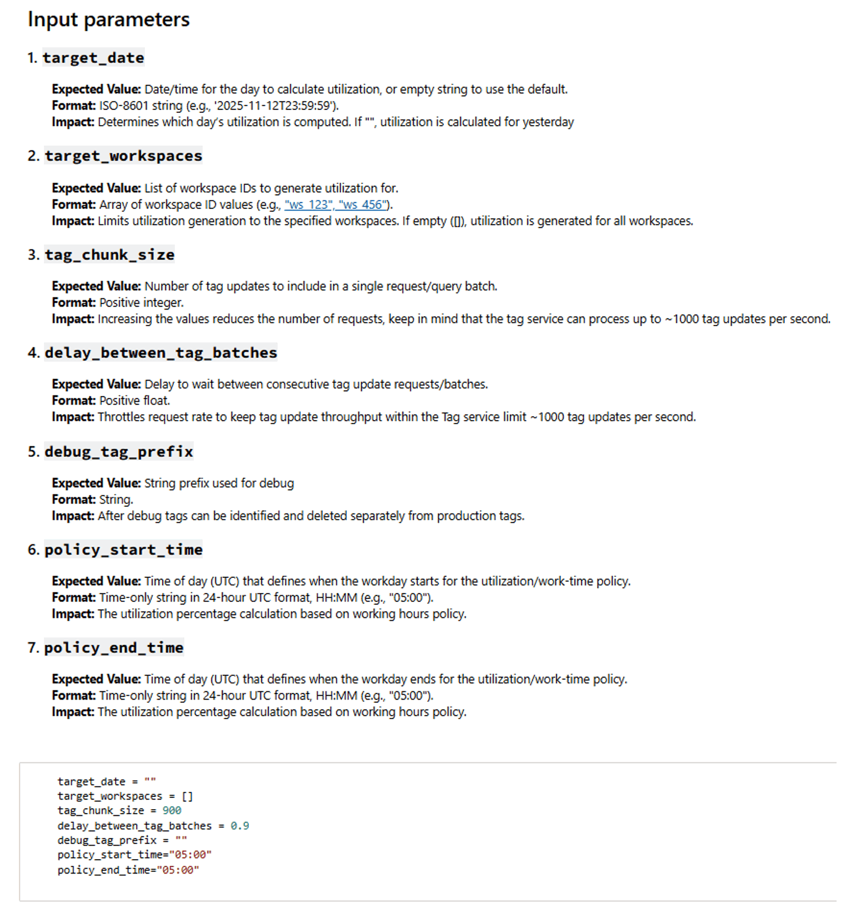

# Lab/System/Asset Utilization Monitoring Example

## Overview:

This example project provides all required resources to configure and execute a Lab/System/Asset Utilization workflow
example. It includes a Jupyter Notebook and instructions for implementing a scheduled routine for data processing and
three Grafana dashboards, each designed to visualize utilization metrics at distinct hierarchical levels.

## Solution Overview:

This example leverages three Grafana dashboards that utilize built-in data sources. System-level and asset-level
utilization data is collected at the SystemLink client layer, automatically transmitted to SystemLink, and made
accessible through standard APIs. The example project includes a preconfigured Jupyter Notebook that processes raw
utilization history, generates initial tags, and subsequently appends new utilization values upon each execution. This
approach ensures that every system and asset is associated with utilization-specific tags, enabling straightforward
visualization through Grafana dashboards using out-of-the-box data sources.

After importing the dashboard into SystemLink, the following predefined dashboards become available. Each dashboard
implements a hierarchical drill-down approach and includes dropdown selectors for Labs, Systems, and Assets. The
dashboards present high-level utilization metrics along with two time-series charts that display utilization trends for
the selected timeframe across two default categories: _Test_ and _Configuration_.

1. Lab Utilization Dashboard
    - Lab-level utilization is derived from the aggregate utilization of all systems grouped within a single workspace.
      To enable tracking at the Lab level, systems must be organized into workspaces and mapped to their corresponding
      physical Lab.
      
2. System Utilization
    - When the System Utilization dashboard is opened, users can select the desired Lab to locate a specific system for
      utilization analysis. These selectors are positioned in the upper section of the dashboard.
    - The drill-down view provides detailed insights, including the total number of systems within the selected Lab or
      workspace, their connection status, and system-level details presented in a tabular format.
    - All dashboards share a consistent UI layout and include two time-series charts that display utilization metrics
      for each predefined utilization category.
      
3. Asset Utilization
    - The Asset Utilization dashboard provides functionality like the System Utilization dashboard but extends
      visibility to asset-level details within the selected system. This includes additional information such as
      calibration status. The dashboard presents high-level metrics along with two time-series charts that visualize
      utilization trends for the selected assets across predefined categories.
      

## Step-by-step installation Instructions:

Solution installation and configuration information is provided with the below step-by-step instructions.

**Publishing the Notebook**

1. To import the Jupyter notebook into your SystemLink Enterprise open **Automation >> Scripts** from the SLE main menu,
   click the **Upload** **Files** button and select the _Utilization to Tags SLE.ipynb_ notebook.
   
2. Notebook has the following input parameters shown below.  
   
3. Right-click the notebook file and select **Publish to SystemLink** from the list.
4. In the **Publish Notebook** window select the workspace where you want the notebook to be available.  
   
5. From the **Interface** drop-down select **Periodic Execution**.
6. Click **Publish to SystemLink** button.

_For more information about publishing a notebook, see the documentation available
on [ni.com](https://www.ni.com/docs/en-US/bundle/systemlink-enterprise/page/publishing-a-jupyter-notebook.html)_

After publishing the notebook to SLE, a confirmation popup will appear indicating the operation was successful. You can
then proceed to configure the routine for scheduled execution.

**Setting Up a Routine**

1. Open the SystemLink menu and navigate to **Automation >> Routines**.
2. On the Routines page, click **Create routine** in the upper-left corner of the window.
3. In the Create routine window under **General** section, provide the following details:
    - Routine name and description
    - Ensure **Routine State** is enabled
      
4. In **Automation configuration** section:
    - From the Event dropdown, select **at a specific data and time**.
    - Set the **Start date and time**. This determines when the notebook will run daily to update the tags.
    - Leave the **Repeat** field set to **Daily**.
    - In the **Automation** field leave **Execute a notebook** selected.
    - To select the notebook that should be executed in selected time every day, from the **Notebook** drop-down select
      the notebook you published earlier.
    - Click **Create**. Your routine will now appear in the table along with other routines.
5. Go to **Automation >> Execution** page to monitor the status and the execution history of your notebook.
6. After the notebook runs successfully at the scheduled time, tags will be generated for each system and asset.
   Navigate to **Systems Management >> Systems,** select a system and open the **Tags** tab for viewing tags associated
   with the system. You will see a new section of tags called Utilization. These tags will be updated every day with the
   single data point reporting daily utilization.
7. Once all the steps are complete, you can import the dashboard to start viewing utilization data along with other
   system and asset-level information.
8. If you need to start over and delete existing tags, use **Delete Multiple Tags** notebook provided in the same
   location. This will delete all tags so you can restart the process.

**Importing the Dashboard**

1. First locate three `.json` files in the folder to be imported.
2. From SLE main menu, go to **Overview >> Dashboards**.
3. Click **New** in the upper-right corner and select **Import.**
4. In the Import Dashboard window click **Upload dashboard JSON file** and select one of the three .json files to import
   the first dashboard.
5. Change the name of the Dashboard if needed.  
   
6. Select the folder where you want to store the imported dashboard.
7. Modify the UID to ensure uniqueness.
8. Click **Import.** The newly imported dashboard will appear immediately, pre-configured and ready for use.
9. Repeat the import process for the other two `.json` dashboard files until all three dashboards are successfully
   imported.