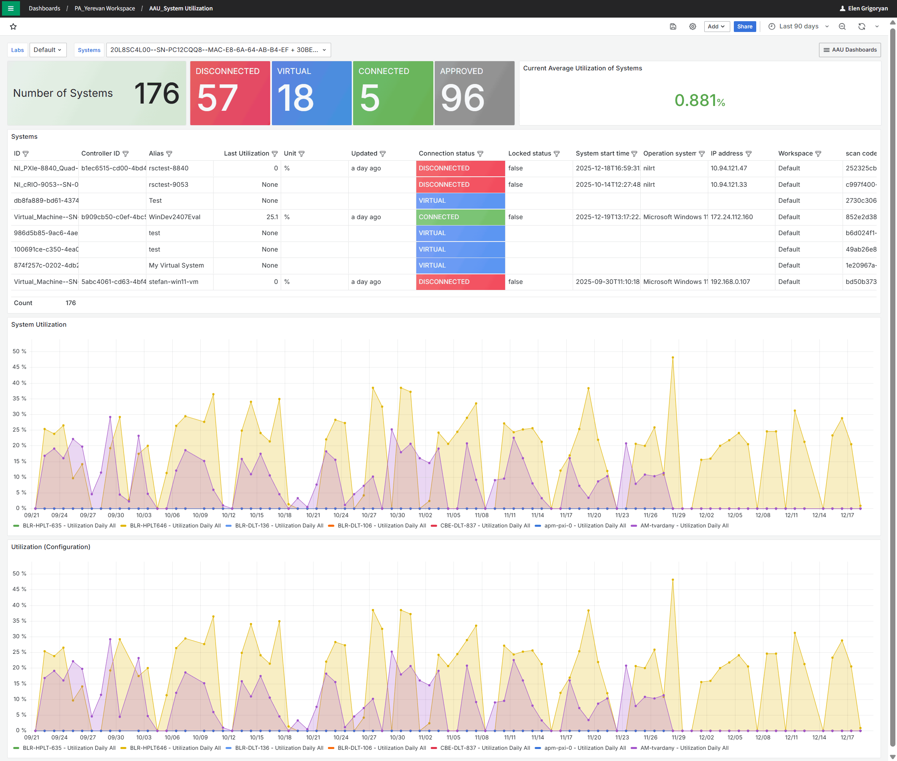
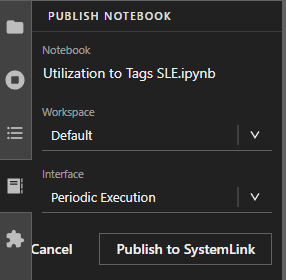
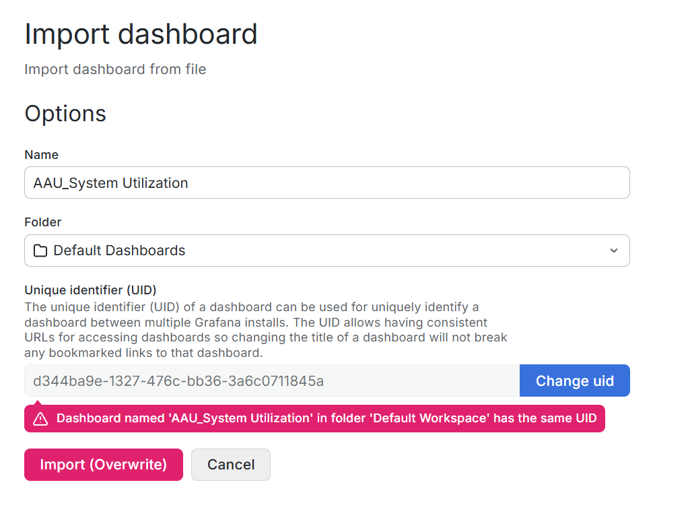

# System Utilization Monitoring Example

## Overview:

This example project provides all required resources to configure and execute a System Utilization workflow
example. It includes a Jupyter Notebook and instructions for implementing a scheduled routine for data processing and
a Grafana dashboard designed to visualize system utilization metrics.

## Solution Overview:

This example leverages a Grafana dashboard that utilizes built-in data sources. System-level
utilization data is collected at the SystemLink client layer, automatically transmitted to SystemLink, and made
accessible through standard APIs. The example project includes a preconfigured Jupyter Notebook that processes raw
utilization history, generates initial tags, and subsequently appends new utilization values upon each execution. This
approach ensures that every system is associated with utilization-specific tags, enabling straightforward
visualization through the Grafana dashboard using out-of-the-box data sources.

After importing the dashboard into SystemLink, the following predefined dashboard becomes available. The dashboard
implements a drill-down approach and includes a dropdown selector for Systems. The
dashboard presents high-level utilization metrics along with two time-series charts that display utilization trends for
the selected timeframe across two default categories: _Test_ and _Configuration_.

1. System Utilization
    - When the System Utilization dashboard is opened, users can select a specific system for
      utilization analysis. These selectors are positioned in the upper section of the dashboard.
    - The drill-down view provides detailed insights, including the total number of systems,
      their connection status, and system-level details presented in a tabular format.
    - The dashboard includes two time-series charts that display utilization metrics
      for each predefined utilization category.
      

## Step-by-step installation Instructions:

Solution installation and configuration information is provided with the below step-by-step instructions.

**Prerequisites**
- SystemLink Client: 2023 Q4 or later
- Both 32-bit and 64-bit supported

**Supported Drivers (Latest Versions)**

- NI VISA
- NI MI
  - NI-DCPower
  - NI-Digital
  - NI-DMM
  - NI-FGEN
  - NI-Scope
  - NI-Switch
- NI RF
  - NI-RFSA
  - NI-RFSG

**Enabling Device-Level Utilization**

The Device-Level Utilization feature is toggled on and off using registry keys. You can toggle the feature by deploying
a salt state file or manually creating the keys.

*Salt State Deployment (Recommended)*

- The salt state here is configured to set the registry keys to [enable](./Attachments/Enable%20VISA%20Utilization.sls) Device-Level Utilization
- The salt state here is configured to set the registry keys to [disable](./Attachments/Disable%20VISA%20tracking.sls) Device-LevelUtilization
1. To deploy a salt state to a machine, select that system and then select the Software tab.
2. Select the States option from the sidebar menu.
3. Find the given state and click install.

*Manual key creation/editing*

1. Open the Windows Registry Editor.
2. Navigate to one of the follwing paths
   - 32-bit Path: [HKEY_LOCAL_MACHINE\SOFTWARE\WOW6432Node\National Instruments\SystemSettings\]
   - 64-bit Path: [HKEY_LOCAL_MACHINE\SOFTWARE \National Instruments\SystemSettings\]
3. If “nivisaDeviceUtilizationTracking” is present, edit the true/false value to toggle the feature.
4. If it is not present, right click and select **New>Key**
5. Name the key nivisaDeviceUtilizationTracking
6. Add a new string value and set the data field to true to enable Device-Level Utilization.

**Publishing the Notebook**

1. To import the Jupyter notebook into your SystemLink Enterprise open **Automation >> Scripts** from the SLE main menu,
   click the **Upload** **Files** button and select the _Utilization to Tags SLE.ipynb_ notebook.
   
2. Notebook has the following input parameters shown below.  
   
3. Right-click the notebook file and select **Publish to SystemLink** from the list.
4. In the **Publish Notebook** window select the workspace where you want the notebook to be available.  
   
5. From the **Interface** drop-down select **Periodic Execution**.
6. Click **Publish to SystemLink** button.

After publishing the notebook to SLE, a confirmation popup will appear indicating the operation was successful. You can
then proceed to configure the routine for scheduled execution.

**Setting Up a Routine**

1. Open the SystemLink menu and navigate to **Automation >> Routines**.
2. On the Routines page, click **Create routine** in the upper-left corner of the window.
3. In the Create routine window under **General** section, provide the following details:
    - Routine name and Description
    - Ensure **Routine State** is enabled
      
4. In **Automation configuration** section:
    - From the Event dropdown, select **at a specific data and time**.
    - Set the **Start date and time**. This determines when the notebook will run daily to update the tags.
    - Leave the **Repeat** field set to **Daily**.
    - In the **Automation** field leave **Execute a notebook** selected.
    - To select the notebook that should be executed in selected time every day, from the **Notebook** drop-down select
      the notebook you published earlier.
    - Click **Create**. Your routine will now appear in the table along with other routines.
5. Go to **Automation >> Execution** page to monitor the status and the execution history of your notebook.
6. After the notebook runs successfully at the scheduled time, tags will be generated for each system.
   Navigate to **Systems Management >> Systems,** select a system and open the **Tags** tab for viewing tags associated
   with the system. You will see a new section of tags called Utilization. These tags will be updated every day with the
   single data point reporting daily utilization.
7. Once all the steps are complete, you can import the dashboard to start viewing utilization data along with other
   system-level information.
8. If you need to start over and delete existing tags, use **Delete Multiple Tags** notebook provided in the same
   location. This will delete all tags so you can restart the process.

**Importing the Dashboard**

1. From SLE main menu, go to **Overview >> Dashboards**.
2. Click **New** in the upper-right corner and select **Import.**
3. In the Import Dashboard window click **Upload dashboard JSON file** and select the .json file to import
   the dashboard.
4. Change the name of the Dashboard if needed.  
   
5. Select the folder where you want to store the imported dashboard.
6. Modify the UID to ensure uniqueness.
7. Click **Import.** The newly imported dashboard will appear immediately, pre-configured and ready for use.